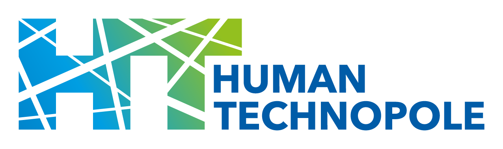

<h1> 2024 Conference</h1>

 

<!-- [Registration Now Open](https://tinyurl.com/I2K-2023-Zoom)

[Submit a Workshop by October 6](https://airtable.com/appE66koIe2ofWJw7/shr2DZI2uwCyw4taP)-->

<!-- 2023 Workshops now available on [YouTube](https://www.youtube.com/playlist?list=PLdA9Vgd1gxTbxX2ETMt3tFICL0DbyqFhb)

Recordings of 2022 conference material are available on [YouTube](https://www.youtube.com/channel/UCMBPBsR9WmzgefQWEyxfomg). -->
<!-- if we have a Pre-Event Checklist, it will go here
 
<a href="https://tinyurl.com/I2K-2023-PrepChecklist">Pre-Event Checklist</a>
 
 
-->

## About

The 2024 I2K conference, happening **October 23-25** at the [Human Technopole](https://humantechnopole.it/en/) in **Milan, Italy**, is a key meeting point for anyone passionate about the intersection of life sciences and quantitative image analysis. 

This year, we are excited to present a program dense of insightful talks from leading voices in the field, alongside selected presentations from your submitted abstracts. Additionally, the conference will offer hands-on workshops focused on state-of-the-art open-source tools for working with and analyzing scientific image data. It is an ideal opportunity to exchange ideas and discover innovative approaches for managing the growing volume of detailed microscopy images. Looking forward to seeing you there!

Please note that to secure your seat at the conference, you must register on the event webpage when registrations will be open.

**Registration fee** 

- PhD Student/Postdoc: 250 €

- Academic: 450 €

- Industry/Commercial: 750 €

 The registration deadline will be close to the notification for abstracts.

**Important Dates** 

- Workshop submission deadline: 
<b style="color: #027cbd;">15 May 2024</b>
 
- Workshop notification:
<b style="color: #027cbd;">3 June 2024</b>
 
- Abstract submission deadline:
<b style="color: #027cbd;">31 July 2024</b>
 
- Poster/Oral notification:
<b style="color: #027cbd;">19 August 2024</b>
 
**Links**

- [I2K page at Human Technopole](https://humantechnopole.it/en/trainings/i2k-from-images-to-knowledge-2024/)
- [How to sponsor I2k](https://humantechnopole.it/en/sponsorships/i2k-from-images-to-knowledge-conference-2024/)

If you have questions please contact us at [training@fht.org](mailto:training@fht.org)

## Organizers
##### Organizing Scientific Committee:

Jianxu Chen, <i>ISAS, Leibnitz Institute</i> 
Beth Cimini, <i>Broad Institute of MIT</i> 
Joran Deschamps, <i>Human Technopole</i> 
Florian Jug, <i>Human Technopole</i> 
Anna Kreshuk, <i>European Molecular Biology Laboratory</i> 
Florian Levet, <i>University of Bordeaux</i> 
Stephan Saalfeld, <i>HHMI Janelia</i> 
Aubrey Weigel, <i>HHMI Janelia</i> 

##### Scientific Program and Workshop Organising Committees:

Pete Bankhead, *University of Edinburgh* 
Esti Gomez de Mariscal, *Instituto Gulbenkian de Ciência* 
Kevin Elicieri, *University of Wisconsin-Madison* 
Philipp Erdmann, *Human Technopole* 
Elnaz Fazeli, *University of Helsinki* 
Robert Haase, *University of Leipzig* 
Khaled  Kheairy, *St. Jude Children's Research Hospital* 
Dagmar Kainmueller, *Max Delbrück Center for Molecular Medicine* 
Bronwyn Lucas, *University of California, Berkeley* 
Thomas Pengo, *University of Minnesota* 
Stephan Preibisch, *HHMI Janelia* 
Christian Tischer, *Europen Molecular Biology Laboratory* 
Pavel Tomancak, *Max Planck Institute of Molecular Cell Biology and Genetics* 
Virginie Uhlmann, *BioVisionCenter, University of Zurich* 
Laura Wiggins, *University of Sheffield* 

## Sponsors

   [
   
  Human Technopole (HT)](https://humantechnopole.it/en/)
   
     
   [
   
  BioImaging North America (BINA)](https://www.bioimagingna.org/)
   
   
   
  
   
  [How to sponsor I2k](https://humantechnopole.it/en/sponsorships/i2k-from-images-to-knowledge-conference-2024/)

## Code of Conduct
We have adopted the Chan Zuckerberg Initiative’s  <a href="https://chanzuckerberg.com/ethics-policies/community-participation-guidelines/">Community Participation Guidelines</a>; by participating in this conference you agree to abide by these. If you need to contact the organizers to discuss a violation of these guidelines, please reach out to [training@fht.org](mailto:training@fht.org).

## Connect

 Join the <a href="https://forum.image.sc/">image.sc forum!</a>
 
 
Questions about I2K? Please contact us at: [training@fht.org](mailto:training@fht.org)

## Previous conferences
- [I2K 2023 virtual conference](http://2023.i2kconference.org/)
 
- [I2K 2022 virtual conference](https://2022.i2kconference.org/)
- [I2K 2020 virtual conference](https://www.janelia.org/you-janelia/conferences/from-images-to-knowledge-with-imagej-friends)
- [I2K 2018 conference at EMBL, Heidelberg](https://www.embl.org/about/info/course-and-conference-office/events/imj18-01/)