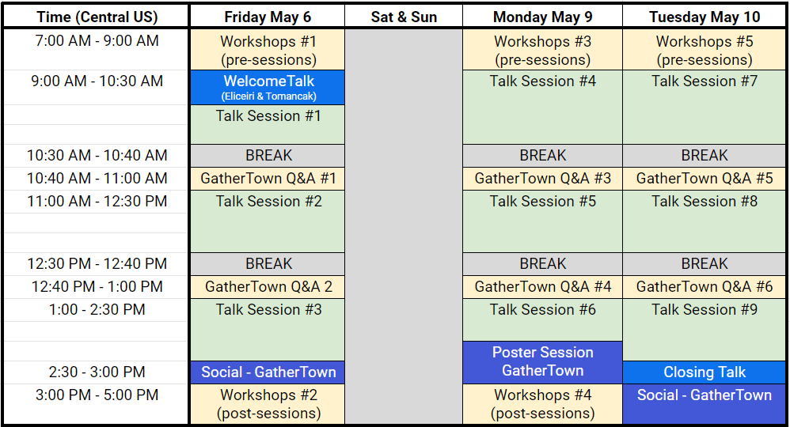

<h1> 2024 Conference</h1>

 

<!-- [Registration Now Open](https://tinyurl.com/I2K-2023-Zoom)

[Submit a Workshop by October 6](https://airtable.com/appE66koIe2ofWJw7/shr2DZI2uwCyw4taP)-->

<!-- 2023 Workshops now available on [YouTube](https://www.youtube.com/playlist?list=PLdA9Vgd1gxTbxX2ETMt3tFICL0DbyqFhb)

Recordings of 2022 conference material are available on [YouTube](https://www.youtube.com/channel/UCMBPBsR9WmzgefQWEyxfomg). -->
<!-- if we have a Pre-Event Checklist, it will go here
 
<a href="https://tinyurl.com/I2K-2023-PrepChecklist">Pre-Event Checklist</a>
 
 
-->

## About

Discovery in the life-sciences increasingly relies on quantitative analysis of microscopy images. The 2024 I2K conference, to be held from October 23th-25th in Milan, Italy, will therefore feature in-depth interactive workshops covering state-of-the-art open-source solutions for biological image reconstruction and analysis. It will be an event to learn about and discuss forward looking strategies for dealing with the ever-increasing amount of large and content rich microscopy imagery. 

As all major open-source platforms for bioimage analysis will be represented including many in the [image.sc forum](https://forum.image.sc/), this will be a great opportunity to learn how to use the best software tools for your research and how to get involved in their development! We will have an exciting range of developers and adopters in the field of computational image analysis participating in the workshop, both as tutors and participants.

If you have questions please contact us at [i2kconference@gmail.com](mailto:i2kconference@gmail.com)

## Program

The program for I2K 2024 consists of live [workshops](https://i2kconference.org/workshops) from presenters around the globe during the 3 days of the event. See [here](https://i2kconference.org/workshops) for the schedule. In some cases, pre-recorded workshops will be made available before the event, and links will be found [here](https://i2kconference.org/workshops), as well as on the [I2K YouTube Channel](https://www.youtube.com/channel/UCMBPBsR9WmzgefQWEyxfomg).
 

Full Program: [Workshops](https://i2kconference.org/workshops)

<!-- if we have a Pre-Event Checklist, it will go here
<a href="https://tinyurl.com/I2K-2023-PrepChecklist">Pre-Event Checklist</a>
 
 
-->

Helpful “Tips & Tricks” for [Zoom Events](https://docs.google.com/document/d/1YNrXEx4sk5I3zdlUiREXE1sMBihcQkuVbTa-_a7bVDg/preview)
 

<!-- if we have a PNG program for the main page, it goes here, otherwise, keep this hidden

-->

<!-- hidden till page links can be fixed
 

### Workshops

[List of Workshops](workshops) 
-->

## FAQ

#### For tutorial presenters

**_I'm a developer of an open source tool that I want to teach people about- how do I get involved?_**

Please sign up via the Airtable link above! You will be asked for a bit of demographic information, as well as information about the workshop you plan to teach, specifically

- The title and presenter list
- A brief (2-5 sentence) description of your workshop
- Keywords associated with your workshop
- Pre-workshop instructions for attendees, as well as how much they should expect to interact in your workshop (is it a general overview/demo, or an interactive hands-on-workshop)
- The target audience (beginners, intermediate users, advanced users, and/or developers)
- When you plan to host this, and how long it will be

**_Can this be anytime on October 17th-19th?_**

Yes! You can host this workshop in any time that works well for you to teach it in. We very much hope to have tutorials appropriate for all time zones!

**_Will only one tutorial be happening at a time?_**

No, not necessarily - since each tutorial presenter signs up for the time best for them, there may be some times with no tutorials running and some with many running simultaneously. A calendar with live updates will be available on the I2K website - the earlier you sign up, the earlier that people can know when your tutorial is (and adjust their time accordingly if needed). 

**_Can I submit more than one tutorial for my tool/tutorials on more than one open-source tool?_**

Yes, please do!

**_How many people should I expect to show up?_**

The distributed way this is run will make it hard for us to say this for sure, but last year's I2K meeting attracted several hundred total attendees. We will be asking attendees to indicate interest in particular tutorials ahead of time, but we will not be controlling who finally shows up on the actual day.

#### For tutorial attendees

**_How do I sign up to attend I2K 2023?_**

More information on how to register will be released in September, but please do feel free to mark your calendars now!

**_What do I need to do to prepare?_**

This will depend on the tutorial in question! The tutorial presenter should indicate this in the information when they post their tutorial. 

**_When will the tutorial for [my favorite tool] be held?_**

That's really up to the creators of that tool! The website will be updated on a rolling basis as sessions are submitted. If you can't make the time chosen, we will be encouraging tutorial presenters to record their workshops for upload afterward.

**_Do I need to indicate ahead of time which session(s) I plan to attend?_**

It won't be required, but will definitely help the tutorial presenters plan, so once registration is live, we strongly encourage you to do so! More instructions will be released when registration opens.

## Organizers
##### 2023 I2K Organizing/Scientific Committee:
Nikki Bialy, <i>BINA, Morgridge Institute for Research</i> 
Beth Cimini, <i>Broad Institute of MIT</i> 
Kevin Eliceiri, <i>University of Wisconsin-Madison</i> 
Vanessa Orr, <i>BINA, Morgridge Institute for Research</i> 
Thomas Pengo, <i>University of Minnesota</i> 

## Sponsors

   [
   
  BioImaging North America (BINA)](https://www.bioimagingna.org/)
   
   
   
  
   
  [Center for Open Bioimage Analysis (COBA)](https://openbioimageanalysis.org/)
   
   
   
  The Society for Knowledge Exchange in Bioimage Analysis

## Code of Conduct
We have adopted the Chan Zuckerberg Initiative’s  <a href="https://chanzuckerberg.com/ethics-policies/community-participation-guidelines/">Community Participation Guidelines</a>; by participating in this conference you agree to abide by these. If you need to contact the organizers to discuss a violation of these guidelines, please reach out to [eliceiri@wisc.edu](mailto:eliceiri@wisc.edu) or [i2kconference@gmail.com](mailto:i2kconference@gmail.com)

## Connect
Join the <a href="https://forum.image.sc/">image.sc forum!</a>
 
 
Questions about I2K? Please contact us at: [i2kconference@gmail.com](mailto:i2kconference@gmail.com)
