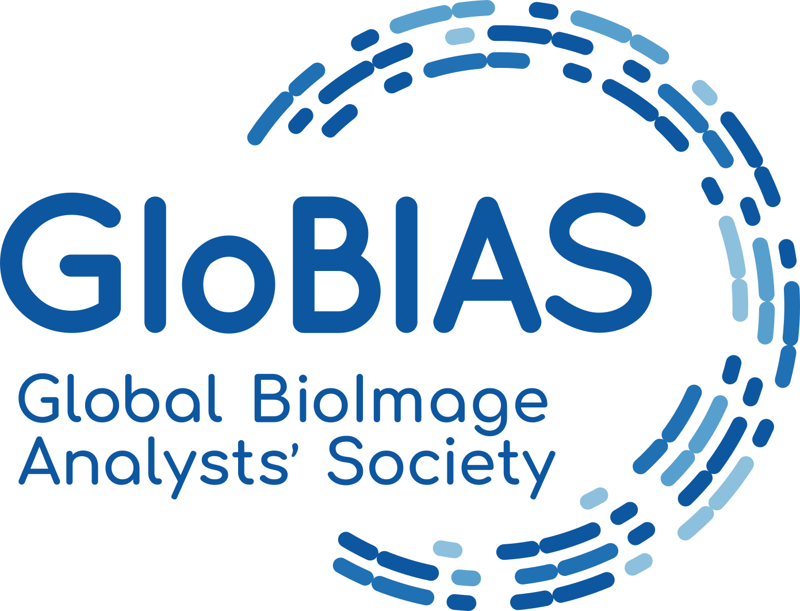

<h1> 2025 Virtual "Halfway to I2K"</h1>

**Halfway to I2K 2025: Free Online Tutorials on Image Analysis from November 17-19, 2025**

## Workshop submission now open!

[Want to present? Submit your workshop at this link](https://airtable.com/app2zpB8d82r7Ldtc/shrTcoN4uBYvFcz6X)

<!---## **Registration now open**

FREE Registration is now open for participation in the Virtual I2K 2024 event! [Click here to register](https://tinyurl.com/Virtual-I2K2024-Registration)--->

## **About**

Discovery in the life-sciences increasingly relies on quantitative analysis of microscopy images. The 2025 FREE online event “Halfway to I2K”, to be held from November 17-19, will therefore feature in-depth interactive workshops covering state-of-the-art open-source solutions for biological image reconstruction and analysis. It will be an event to learn about and discuss forward looking strategies for dealing with the ever-increasing amount of large and content rich microscopy imagery.

As many major open-source platforms for bioimage analysis will be represented including many in the [image.sc forum](https://forum.image.sc/), this will be a great opportunity to learn how to use the best software tools for your research and how to get involved in their development\! We will have an exciting range of developers and adopters in the field of computational image analysis participating in the workshop, both as tutors and participants.

The event is called “Halfway to I2K” since it falls between I2K 2024, held at Human Technopole in Milan, and our soon-to-be-announced 2026 event. The intention is for the community to meet every 2 years in-person, with a virtual component every year, either Virtual I2K the year of the in-person, or “Halfway to I2K” on the years in-between the in-person meetings.

Want to see more about what I2K is all about? Check out the tutorials from previous events on our [YouTube channel](https://www.youtube.com/@I2KConference)!

If you have questions please contact us at i2kconference@gmail.com

---

## **Program**

**The program for Halfway to I2K consists of live [virtual workshops](https://i2kconference.org/workshops) from presenters around the globe during the 3 days of the event. See [here](https://i2kconference.org/workshops) for the schedule so far.** 

**Full Program:** [Virtual Workshops](https://i2kconference.org/workshops)

**Helpful “Tips & Tricks” for** [Zoom Events](https://docs.google.com/document/d/1YNrXEx4sk5I3zdlUiREXE1sMBihcQkuVbTa-_a7bVDg/preview)

<!---**Attendee Registration:** [Click here to register](https://tinyurl.com/Virtual-I2K2024-Registration)--->

## **FAQ**

### **For tutorial presenters**

***I’m a developer of an open source tool that I want to teach people about- how do I get involved?***

We'd love to have your presentation

You will be asked for a bit of demographic information, as well as information about the workshop you plan to teach, specifically

* The title and presenter list

* A brief (2-5 sentence) description of your workshop

* Keywords associated with your workshop

* Pre-workshop instructions for attendees, as well as how much they should expect to interact in your workshop (is it a general overview/demo, or an interactive hands-on-workshop)

* The target audience (beginners, intermediate users, advanced users, and/or developers)

* When you plan to host this, and how long it will be

* Your planned language of instruction

***Can this be anytime on November 17-19?***

Yes\! You can host this workshop in any time that works well for you to teach it in. We very much hope to have tutorials appropriate for all time zones\!

***Will only one tutorial be happening at a time?***

No, not necessarily \- since each tutorial presenter signs up for the time best for them, there may be some times with no tutorials running and some with many running simultaneously. A calendar with live updates is available on the I2K website \- the earlier you sign up, the earlier that people can know when your tutorial is (and adjust their time accordingly if needed).

***Can I submit more than one tutorial for my tool/tutorials on more than one open-source tool?***

Yes, please do\!

***How many people should I expect to show up?***

The distributed way this is run will make it hard for us to say this for sure, but last year’s Virtual I2K meeting attracted several hundred total attendees. We will be asking attendees to indicate interest in particular tutorials ahead of time, but we will not be controlling who finally shows up on the actual day.

### **For tutorial attendees**

***How do I sign up to attend Halfway to I2K?***

<!---[Click here to register](https://tinyurl.com/Virtual-I2K2024-Registration)--->

Keep an eye on this page - registration will open approximately one month before the event (so approximately mid-October)

***What do I need to do to prepare?***

This will depend on the tutorial in question\! The tutorial presenter should indicate this in the information when they post their tutorial, but most will not assume specific preparations.

***When will the tutorial for \[my favorite tool\] be held?***

That’s really up to the creators of that tool\! The website will be updated on a rolling basis as sessions are submitted. If you can’t make the time chosen, we will be encouraging tutorial presenters to record their workshops for upload afterward.

<!---If you want to see a tutorial for a specific tool, you may certainly indicate so in the comments of our announcement forum post!--->

***Do I need to indicate ahead of time which session(s) I plan to attend?***

It won’t be required, but will definitely help the tutorial presenters plan, so we strongly encourage you to do so in the zoom events platform\!

---

## **Organizers**

##### ***2025 Halfway to I2K Organizers:***

*Alex TODO, BINA, Morgridge Institute for Research*  
*Aditi TODO, BINA, Morgridge Institute for Research*  
*Christa Walther, GloBIAS, German BioImaging*

##### ***2025 Halfway to I2K Scientific Committee Organizer:***

<!---*Tereza Belinova, Institute of Science and Technology Austria (ISTA)*  --->
*Beth Cimini, Broad Institute*  
*Kevin Eliceiri, University of Wisconsin-Madison*  
<!---*Esteban Miglietta, Broad Institute*   
*Thomas Pengo, University of Minnesota*--->

---

## **Sponsors**

   
   
  [BioImaging North America (BINA)](https://www.bioimagingna.org/)
   

   
     
  [Center for Open Bioimage Analysis (COBA)](https://openbioimageanalysis.org/)
   

   
     
  [	Global BioImage Analysts' Society (GloBIAS)](https://www.globias.org/)

---

## **Code of Conduct**

We have adopted the Chan Zuckerberg Initiative’s [Community Participation Guidelines](https://chanzuckerberg.com/ethics-policies/community-participation-guidelines/); by participating in this conference you agree to abide by these. If you need to contact the organizers to discuss a violation of these guidelines, please reach out to eliceiri@wisc.edu or i2kconference@gmail.com

---

## **Connect**

Join the [image.sc forum\!](https://forum.image.sc/)

Questions about I2K? Please contact us at: i2kconference@gmail.com
