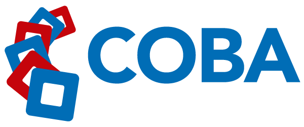
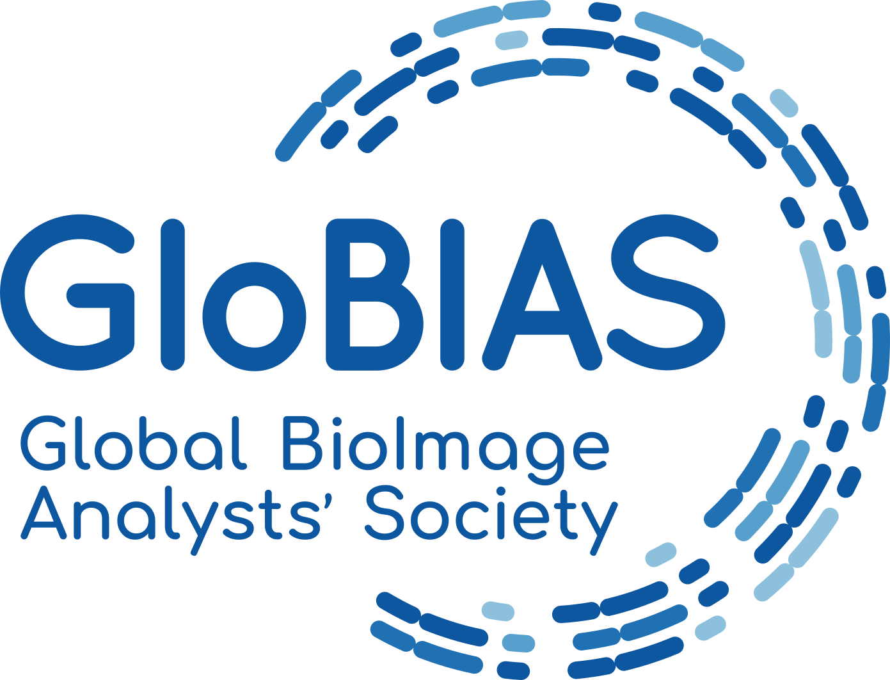

**2024 Virtual I2K 2024 webpage draft**

<!-- ![][image1] -->

Virtual I2K 2024: Online Tutorials on Image Analysis event from October 28-30, 2024

## **About**

Discovery in the life-sciences increasingly relies on quantitative analysis of microscopy images. The 2024 online event “Virtual I2K 2024”, to be held from October 28-30, will therefore feature in-depth interactive workshops covering state-of-the-art open-source solutions for biological image reconstruction and analysis. It will be an event to learn about and discuss forward looking strategies for dealing with the ever-increasing amount of large and content rich microscopy imagery.

As all major open-source platforms for bioimage analysis will be represented including many in the [image.sc forum](https://forum.image.sc/), this will be a great opportunity to learn how to use the best software tools for your research and how to get involved in their development\! We will have an exciting range of developers and adopters in the field of computational image analysis participating in the workshop, both as tutors and participants.

The event is called “Virutal” since it is the virtual counterpart to the in-person I2K 2024, which is October 23-25 at Human Technopole in Milan, Italy. The intention is for the community to meet every 2 years in-person, with a virtual component every year, either Virtual I2K the year of the in-person, or “Halfway to I2K” on the years in-between the in-person meetings.

If you have questions please contact us at i2kconference@gmail.com

---

## **Program**

Submit a workshop to Virtual I2K using [this form](https://airtable.com/appZL2v7JOpcEtqUN/shrREBlIImTkizb6s) ([https://airtable.com/appZL2v7JOpcEtqUN/shrREBlIImTkizb6s](https://airtable.com/appZL2v7JOpcEtqUN/shrREBlIImTkizb6s)) with your proposed workshop details by **Wednesday, October 9th, 2024**. These tutorials will be fully online and asynchronous with a focus on using and developing open source image analysis platforms/tools.  In the form you will be asked to select the day and time you wish to present your workshop, as well as the planned duration.  Workshops will be accepted on a rolling basis.

**The program for Virtual I2K 2024 consists of live [virtual workshops](https://i2kconference.org/workshops) from presenters around the globe during the 3 days of the event. See [here](https://i2kconference.org/workshops) for the schedule.** 

**Full Program:** [Virtual Workshops](https://i2kconference.org/workshops)

**Helpful “Tips & Tricks” for** [Zoom Events](https://docs.google.com/document/d/1YNrXEx4sk5I3zdlUiREXE1sMBihcQkuVbTa-\_a7bVDg/preview)

## **FAQ**

### **For tutorial presenters**

***I’m a developer of an open source tool that I want to teach people about- how do I get involved?***

Please sign up via the Airtable link above\! You will be asked for a bit of demographic information, as well as information about the workshop you plan to teach, specifically

* The title and presenter list

* A brief (2-5 sentence) description of your workshop

* Keywords associated with your workshop

* Pre-workshop instructions for attendees, as well as how much they should expect to interact in your workshop (is it a general overview/demo, or an interactive hands-on-workshop)

* The target audience (beginners, intermediate users, advanced users, and/or developers)

* When you plan to host this, and how long it will be

Can this be anytime on October 28-30?***

Yes\! You can host this workshop in any time that works well for you to teach it in. We very much hope to have tutorials appropriate for all time zones\!

***Will only one tutorial be happening at a time?***

No, not necessarily \- since each tutorial presenter signs up for the time best for them, there may be some times with no tutorials running and some with many running simultaneously. A calendar with live updates will be available on the I2K website \- the earlier you sign up, the earlier that people can know when your tutorial is (and adjust their time accordingly if needed).

***Can I submit more than one tutorial for my tool/tutorials on more than one open-source tool?***

Yes, please do\!

***How many people should I expect to show up?***

The distributed way this is run will make it hard for us to say this for sure, but last year’s I2K meeting attracted several hundred total attendees. We will be asking attendees to indicate interest in particular tutorials ahead of time, but we will not be controlling who finally shows up on the actual day.

### **For tutorial attendees**

***How do I sign up to attend I2K 2024?***

More information on how to register will be released in September, but please do feel free to mark your calendars now\!

***What do I need to do to prepare?***

This will depend on the tutorial in question\! The tutorial presenter should indicate this in the information when they post their tutorial.

***When will the tutorial for \[my favorite tool\] be held?***

That’s really up to the creators of that tool\! The website will be updated on a rolling basis as sessions are submitted. If you can’t make the time chosen, we will be encouraging tutorial presenters to record their workshops for upload afterward.

***Do I need to indicate ahead of time which session(s) I plan to attend?***

It won’t be required, but will definitely help the tutorial presenters plan, so once registration is live, we strongly encourage you to do so\! More instructions will be released when registration opens.

---

## **Organizers**

##### ***2024 Virtual I2K Organizers:***

*Vanessa Orr, BINA, Morgridge Institute for Research*  
*Nikki Bialy, BINA, Morgridge Institute for Research*  
*Christa Walther, GloBIAS, German BioImaging*

##### ***2024 Virtual I2K Scientific Committee Organizer:***

*Tereza Belinova, Institute of Science and Technology Austria (ISTA)*  
*Beth Cimini, Broad Institute*  
*Kevin Eliceiri, University of Wisconsin-Madison*  
*Esteban Miglietta, Broad Institute*   
*Thomas Pengo, University of Minnesota*

---

## **Sponsors**

   
   
  [BioImaging North America (BINA)](https://www.bioimagingna.org/)
   

   
     
  [Center for Open Bioimage Analysis (COBA)](https://openbioimageanalysis.org/)
   

   
     
  [	Global BioImage Analysts' Society (GloBIAS)](https://www.globias.org/)

---

## **Code of Conduct**

We have adopted the Chan Zuckerberg Initiative’s [Community Participation Guidelines](https://chanzuckerberg.com/ethics-policies/community-participation-guidelines/); by participating in this conference you agree to abide by these. If you need to contact the organizers to discuss a violation of these guidelines, please reach out to eliceiri@wisc.edu or i2kconference@gmail.com

---

## **Connect**

Join the [image.sc forum\!](https://forum.image.sc/)

Questions about I2K? Please contact us at: i2kconference@gmail.com
