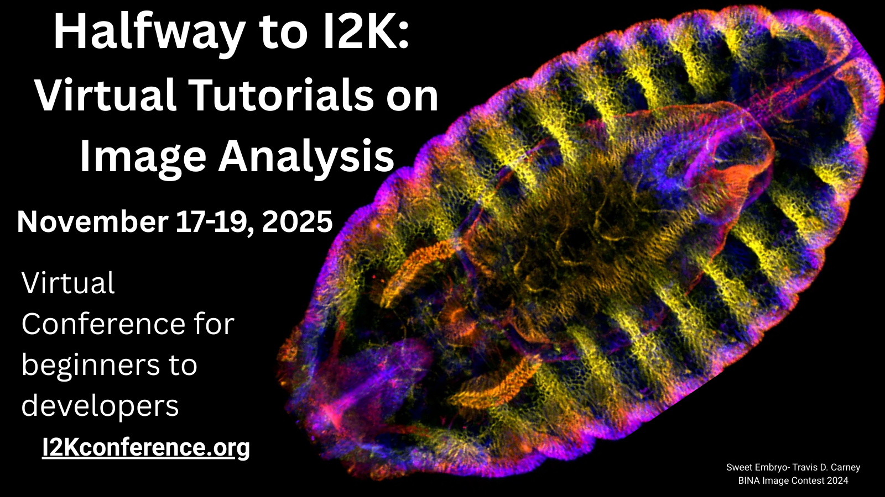

<h1>Workshops</h1>

Workshops are being held per the organizer's preferences over the course of November 17-19, 2025. Please see the <a href="#calendar">calendar view</a> below for specific workshop times, and the <a href="#table">table view</a> for workshop details.

[Want to present? Submit your workshop at this link](https://airtable.com/app2zpB8d82r7Ldtc/shrTcoN4uBYvFcz6X)

FREE Registration is now open for Halfway to I2K 2025! [Click here to register](https://tinyurl.com/Halfway-to-I2K-2025)

<!--- 2024 workshop recordings are now available on [YouTube](some other link)--->

Please reach out to [i2kconference@gmail.com](mailto:i2kconference@gmail.com) if you have any questions.

<h2 id="calendar">Calendar View</h2>
Use the filter, sort, search, and timescale buttons to curate your view of the calendar.

Note - times are displayed in your local time

<iframe class="airtable-embed" src="https://airtable.com/embed/app2zpB8d82r7Ldtc/shrWVOqHuAIe3S4Uz?backgroundColor=greenLight&viewControls=on" frameborder="0" onmousewheel="" width="100%" height="650" style="background: transparent; border: 1px solid #ccc;"></iframe>

 
 
 

<h2 id="table">Table View</h2>
Each record can be viewed in full by clicking on the expansion arrows in the first cell in the far-left column.  The spreadsheet below can also be downloaded; however, the data is continually being updated so check here for the current information.

<iframe class="airtable-embed" src="https://airtable.com/embed/app2zpB8d82r7Ldtc/shrg8twlmqbyhGYAM?viewControls=on" frameborder="0" onmousewheel="" width="100%" height="533" style="background: transparent; border: 1px solid #ccc;"></iframe>

 
 
 

<small>Hosted on GitHub Pages &mdash; Theme by <a href="https://twitter.com/mattgraham">mattgraham</a></small>

